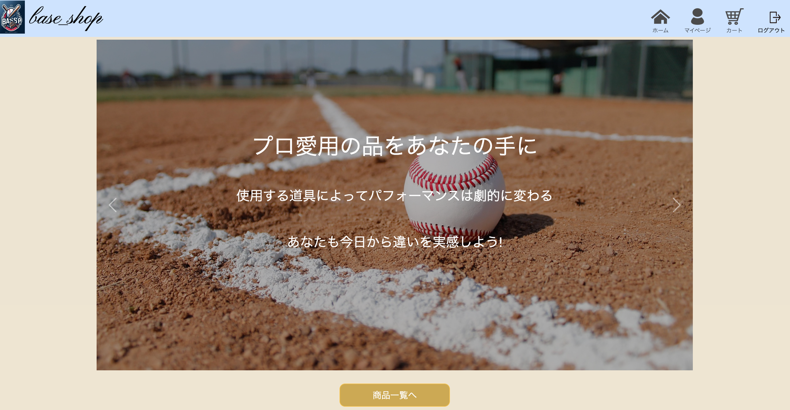
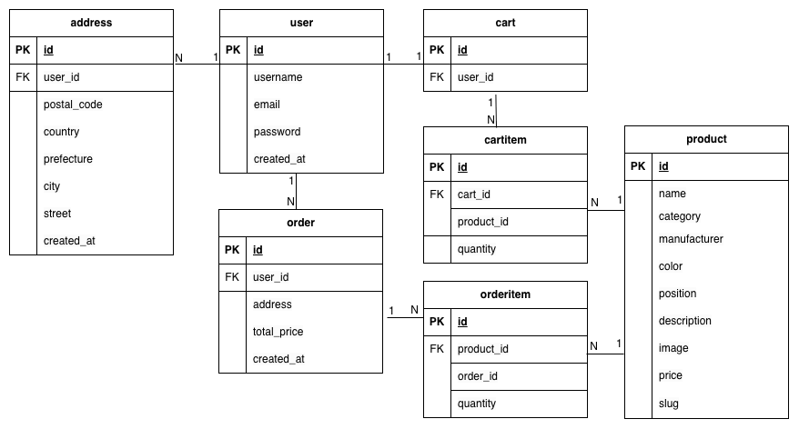

# 野球用品ECサイト（ポートフォリオ）

## 概要
野球用品をオンラインで購入できるECサイトです。
ユーザーは商品閲覧、カート追加、注文、購入履歴の閲覧が可能です。

## 想定利用シーン
小規模ECを想定しています。

## デモ
https://blooming-island-48446-7dae472217b3.herokuapp.com/

## スクリーンショット

## 使用技術
- Python / Django
- HTML / CSS / Bootstrap
- SQLite（学習用）
- GitHub

## 主な機能
- ユーザー登録 / ログイン
- 商品一覧 / 詳細表示
- カート機能
- 注文機能
- マイページ機能
- 管理者による商品管理

## 画面構成
- トップページ
- 商品一覧
- 商品詳細
- カート
- 注文確定
- 注文完了
- マイページ

## ER図

## 技術選定理由
- Django  
  認証機能や管理画面がデフォルトで用意されており、
  ECサイトと相性が良いため。
- RDB  
  注文・商品・ユーザーの関係を
  明確に管理できるため。

## セキュリティ対策
- Django標準の認証・CSRF・XSS対策を利用
- ログインユーザーの権限チェックを実装

## 起動方法(Local)
1. リポジトリをclone
2. 仮想環境を作成
3. 依存関係をインストール
4. サーバー起動
5. http://localhost:8000 にアクセス

##  工夫した点
- 注文と注文明細を分けて管理
- マイページで購入履歴閲覧
- 業務アプリを意識した設計

## 今後の改善点
- クレジットカード決済機能の追加
- 発送住所を複数選択可能にする
